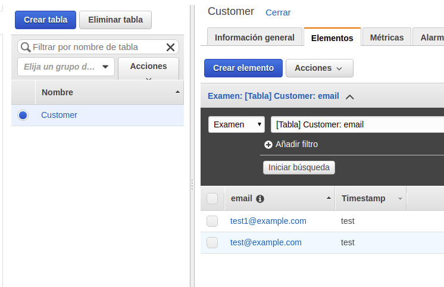
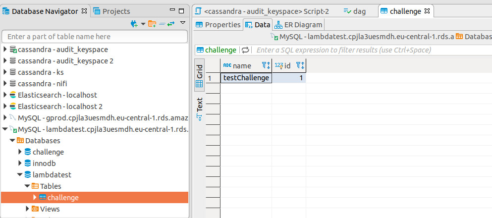

AWS Lambda function to fetch data from a DynamoDB and a relational DB

CRUD for DynamoDB and GET for RDS DB

URL: */Prod/Challenge?TableName=Customer&TableNameRDS=challenge

Create table in DynamoDB and RDS DB

DynamoDB

 

RDS

 

 

Create a Zip:
1- $ zip function.zip index.js
2- $ aws lambda update-function-code --function-name my-function --zip-file fileb://function.zip

Add environment variables:
dbdatabase
dbhost
dbpassword
dbuser